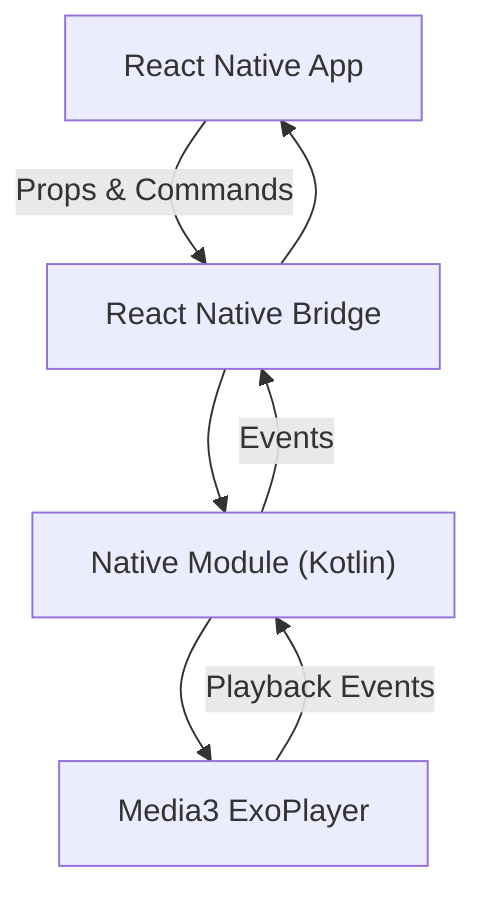
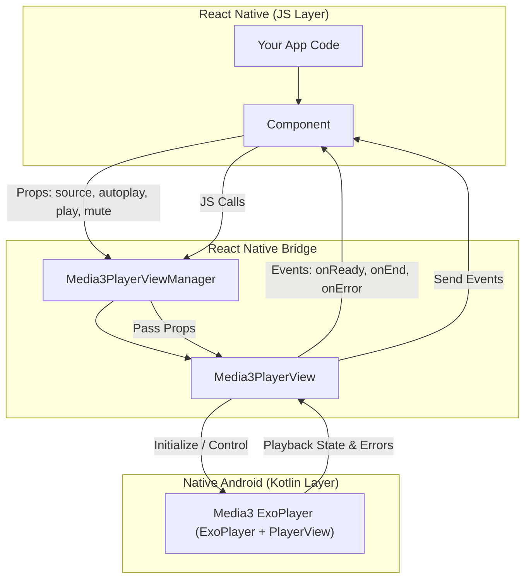
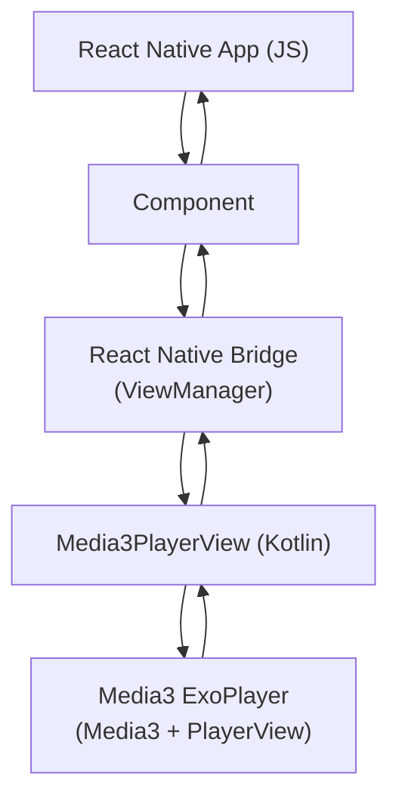

# 📽️ Media3Player

> A lightweight, high-performance React Native video player powered by Android Media3 (ExoPlayer). Fully customizable and supports autoplay, mute, and event handling. This is **Android** only package.

---

## Table of Contents

- [Installation](#installation)
- [Usage](#usage)
- [Props](#props)
- [Events](#events)
- [TypeScript Support](#typescript-support)
- [Examples](#examples)
- [Screenshots](#screenshots)
- [Contributing](#contributing)
- [License](#license)

---

## Installation

**Install via npm:**

```bash
npm install react-native-media3-player
```

**Or yarn:**

```bash
yarn add react-native-media3-player
```

> Requires **React Native >= 0.70**

---

## Usage

```jsx
import React from 'react';
import {View} from 'react-native';
import Media3Player from 'react-native-media3-player';

export default function App() {
  return (
    <View style={{flex: 1}}>
      <Media3Player
        style={{width: '100%', height: 250}}
        source={{uri: 'https://example.com/video.mp4'}}
        autoplay={true}
        play={true}
        mute={false}
        onReady={() => console.log('Player is ready')}
        onEnd={() => console.log('Video ended')}
        onError={error => console.log('Player error:', error.message)}
      />
    </View>
  );
}
```

---

## Props

| Prop       | Type                         | Default                          | Description                                                 |
| ---------- | ---------------------------- | -------------------------------- | ----------------------------------------------------------- |
| `source`   | `{ uri: string }`            | required                         | Video source object. Must include a valid URI.              |
| `autoplay` | `boolean`                    | `false`                          | Automatically start playback when the video is ready.       |
| `play`     | `boolean`                    | `false`                          | Controls whether the player is playing. Overrides autoplay. |
| `mute`     | `boolean`                    | `false`                          | Mutes or unmutes the video.                                 |
| `style`    | `ViewStyle` or `ViewStyle[]` | `{ width: '100%', height: 250 }` | Styling for the player container.                           |

---

## Events

| Event     | Callback Signature                     | Description                                                                            |
| --------- | -------------------------------------- | -------------------------------------------------------------------------------------- |
| `onReady` | `() => void`                           | Fired when the player is ready to play.                                                |
| `onEnd`   | `() => void`                           | Fired when the video reaches the end.                                                  |
| `onError` | `(error: { message: string }) => void` | Fired when the player encounters an error. Error object includes a `message` property. |

---

## TypeScript Support

This library includes TypeScript definitions. Example:

```ts
import React from 'react';
import {ViewStyle} from 'react-native';
import Media3Player, {Media3PlayerProps} from 'react-native-media3-player';

const props: Media3PlayerProps = {
  source: {uri: 'https://example.com/video.mp4'},
  autoplay: true,
  play: true,
  mute: false,
  style: {width: '100%', height: 250},
  onReady: () => console.log('Ready'),
  onEnd: () => console.log('End'),
  onError: err => console.log(err.message),
};
```

---

## Examples

**Basic Player:**

```jsx
<Media3Player source={{uri: 'https://example.com/video.mp4'}} />
```

**Autoplay & Mute:**

```jsx
<Media3Player source={{uri: 'https://example.com/video.mp4'}} autoplay mute />
```

**Event Handling:**

```jsx
<Media3Player
  source={{uri: 'https://example.com/video.mp4'}}
  onReady={() => console.log('Ready')}
  onEnd={() => console.log('End')}
  onError={err => console.error(err.message)}
/>
```

---

## Contributing

We welcome contributions!

1. Fork the repo
2. Create a branch (`git checkout -b feature/new-feature`)
3. Commit your changes (`git commit -m 'Add feature'`)
4. Push to the branch (`git push origin feature/new-feature`)
5. Open a Pull Request

> Please follow [Semantic Versioning](https://semver.org/) for commits.

---

## License

MIT © [Mohammad Rehan](https://github.com/mdRehan991)

---

## Data Flow Diagram ( DFD )

**Level 0 DFD**



---

**Level 1 DFD**



---

## Arch Diagram


